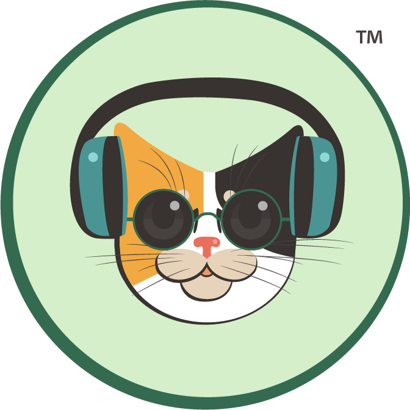

# RadioCalico 🎧

A modern web-based radio streaming platform delivering high-quality audio with a clean, user-friendly interface. RadioCalico is ad-free, data-free, and subscription-free.



## Features

- **High-Quality Streaming**: 24-bit/48kHz lossless audio via HLS (HTTP Live Streaming)
- **Clean Interface**: Minimal, intuitive design following the RadioCalico brand style guide
- **Lightweight Backend**: Express.js server with SQLite database
- **Docker-Ready**: Fully containerized for easy deployment and development
- **Hot-Reload Development**: Automatic server restart on code changes via nodemon
- **RESTful API**: Simple API for user management and future feature expansion

## Tech Stack

- **Backend**: Node.js with Express.js
- **Database**: SQLite (file-based, lightweight)
- **Frontend**: HTML5, CSS3, JavaScript (vanilla)
- **Containerization**: Docker & Docker Compose
- **Audio Streaming**: HLS (HTTP Live Streaming)

## Quick Start

### Prerequisites

- Docker and Docker Compose installed on your system
- Port 3000 available

### Installation & Running

1. Clone the repository:
```bash
git clone https://github.com/bogdannastase74/radio-calico.git
cd radio-calico
```

2. Start the server:
```bash
docker compose up -d
```

3. Open your browser and navigate to:
```
http://localhost:3000
```

4. View logs (optional):
```bash
docker compose logs -f
```

5. Stop the server:
```bash
docker compose down
```

### Rebuild After Changes

If you modify the Dockerfile or dependencies:
```bash
docker compose up -d --build
```

## Project Structure

```
radio-calico/
├── src/
│   └── server.js              # Main Express server application
├── public/
│   ├── index.html             # Frontend HTML structure
│   ├── styles.css             # CSS styling (brand-compliant)
│   ├── script.js              # JavaScript functionality
│   └── RadioCalicoLogoTM.png  # Logo for web interface
├── data/
│   └── database.sqlite        # SQLite database (auto-generated)
├── RadioCalicoStyle/
│   ├── RadioCalicoLayout.png  # Layout design reference
│   ├── RadioCalicoLogoTM.png  # Original logo file
│   ├── RadioCalico_Style_Guide.txt  # Brand & UI style guide
│   └── stream_URL.txt         # HLS stream URL configuration
├── docker-compose.yml         # Docker Compose configuration
├── Dockerfile                 # Docker container definition
├── package.json               # Node.js dependencies
└── README.md                  # This file
```

## API Documentation

### Base URL
```
http://localhost:3000
```

### Current Endpoints

#### Health Check
```http
GET /api/health
```
Returns server health status.

**Response:**
```json
{
  "status": "healthy",
  "timestamp": "2025-12-27T12:00:00.000Z"
}
```

**Testing:**
```bash
curl http://localhost:3000/api/health
```

### Planned Endpoints

The following streaming-related endpoints are planned for future implementation:

- `GET /api/stream` - Stream information and metadata
- `GET /api/nowplaying` - Currently playing track information
- `GET /api/schedule` - Program schedule
- `GET /api/history` - Recently played tracks
- `GET /api/stats` - Listener statistics

## Development

### Local Development Workflow

The server uses **nodemon** for automatic hot-reloading. Any changes to files in `src/` or `public/` will automatically restart the server.

1. Make your code changes
2. Save the file
3. Watch the logs to see the server restart:
```bash
docker compose logs -f
```
4. Refresh your browser to see changes

### Database Schema

#### Users Table
```sql
CREATE TABLE users (
  id INTEGER PRIMARY KEY AUTOINCREMENT,
  name TEXT NOT NULL,
  email TEXT UNIQUE NOT NULL,
  created_at DATETIME DEFAULT CURRENT_TIMESTAMP
)
```

### Style Guide

RadioCalico follows a specific brand and UI style guide located in `RadioCalicoStyle/RadioCalico_Style_Guide.txt`. Key design elements:

- **Color Palette**: Mint (#D8F2D5), Forest Green (#1F4E23), Teal (#38A29D), Calico Orange (#EFA63C)
- **Typography**: Montserrat for headings, Open Sans for body text
- **Layout**: 12-column grid, 1200px max width, 24px gutters
- **Voice**: Friendly, expert, no-nonsense

## Audio Streaming

RadioCalico uses HLS (HTTP Live Streaming) for delivering high-quality audio. The stream URL is configured in:
```
RadioCalicoStyle/stream_URL.txt
```

Current stream format: 24-bit/48kHz lossless

## Contributing

Contributions are welcome! Please follow these steps:

1. Fork the repository
2. Create a feature branch (`git checkout -b feature/amazing-feature`)
3. Commit your changes (`git commit -m 'Add amazing feature'`)
4. Push to the branch (`git push origin feature/amazing-feature`)
5. Open a Pull Request

## Roadmap

- [ ] User authentication and profiles
- [ ] Playlist management
- [ ] Song history and favorites
- [ ] Mobile-responsive design improvements
- [ ] Social features (chat, song requests)
- [ ] Admin dashboard
- [ ] Analytics and listener stats

## License

This project is currently unlicensed. Please contact the repository owner for usage permissions.

## Acknowledgments

- Logo and branding designed for RadioCalico
- Built with modern web technologies and best practices
- Inspired by the simplicity of classic radio with modern streaming capabilities

---

**RadioCalico** - Crystal-clear audio, zero compromises. 🐱🎧
